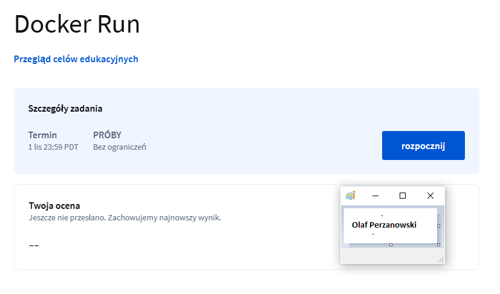

# Docker for beginners

Docker for beginners jest kursem na portalu Coursera, w któym wytłumaczono działanie dockera, jego najważniejsze funkcje oraz zalety. Kurs jest dla początkujących, kolejne modsuły zawierają coraz bardziej profesjonalne funkcje. Poniżej zostaną przedstawione kolejne moduły wraz ze screenami potwierdzającymi zaliczenie testów kończących moduł.

---

## Moduł 1

Kurs rozpoczyna się od podstaw dockera. W module wytłumaczono, czym jest docker, jak go zainstalować oraz pokazuje różnice w działaniu na linuxie a Windowsie. 

### Screen potwierdzający zaliczenie modułu

---

## Moduł 2

Drugi moduł przedstawia podstawowe komendy dockera. Pokazane zostają funkcje takich komend jak: docker run, docker ps, docker stop, docker rm, docker images, docker rmi.

### Screeny potwierdzające zaliczenie modułu

---

## Moduł 3

Trzeci moduł dokładniej wytłumaczył komendę docker run tworzącą kontener. W tym module pokazanio działanie dodatkowych argumentów komendy takich jak: -d (detached mode), -p (ustawienie portów), --name (nazwanie kontenera własną nazwą).

### Screeny potwierdzające zaliczenie modułu

---

## Moduł 4

Czwarty moduł dokładniej tłumaczył images (obrazy). Zostało pokazane jak tworzyć własne images za pomocą Dockerfile i pobierać je potem z docker hub. Wytłumaczone zostały zmienne środowiskowe oraz różnice między CMD a ENTRYPOINT.

### Screeny potwierdzające zaliczenie modułu

---

## Moduł 5

Piąty moduł wprowadzał w temat docker-compose, a więc pliku, który ułatwiał zarządzaniu kontenerami. Docker compose pozwala w prosty sposób łączyć wiele kontenerów w jeden serwis. Jest to plik yaml, a więc plik konfiguracyjny klucz-wartość. 

### Screeny potwierdzające zaliczenie modułu

---

## Moduł 6

Moduł szósty dostarcza wiedzy potrzebnej do zrozumienia mechanizmów działania dockera, a więc zrozumienie architektury docker engine oraz w jaki sposób docker storage przechowuje dane.

### Screeny potwierdzające zaliczenie modułu

---

## Moduł 7

Siódmy moduł tłumaczył podstawowe mechanizmy networkingu w dockerze. Zostało wytłumaczone w jaki sposób kontenery są ze sobą połączone. Moduł pokazuje również jak tworzyć własne sieci, w jakim celu to robić. Moduł tłumaczy również mechanizm docjker registry, a więc rejestrów obrazów. Pokazane zostało jak można zapisać obraz lokalnie (stworzyć swój rejestr), a następnie pobierać obraz lokalnie.

### Screeny potwierdzające zaliczenie modułu

---

## Moduł 8

Moduł ósmy pokazywał jak używać dockera na Windowsie oraz Macu.

---

## Moduł 9

Moduł dziewiąty pokazywał ogólne działanie docker swarm oraz docker kubernetes, które są narzędziami potrzebnymi w zarządzaniu dużą ilością kontenerów. Moduł pokazuje różnice między tymi narzędziami. 

### Screeny potwierdzające zaliczenie modułu

---

## Moduł 10

Moduł dziesiąty jest podsumowaniem kursu. 

### Screen potwierdzający wykonanie całego kursu

