# Running containers

Ćwiczenie pierwsze zawiera podstawowe komendy dotyczące uruchamiania kontenerów dockera.  

### Aktualnie zainstalowane obrazy na maszynie

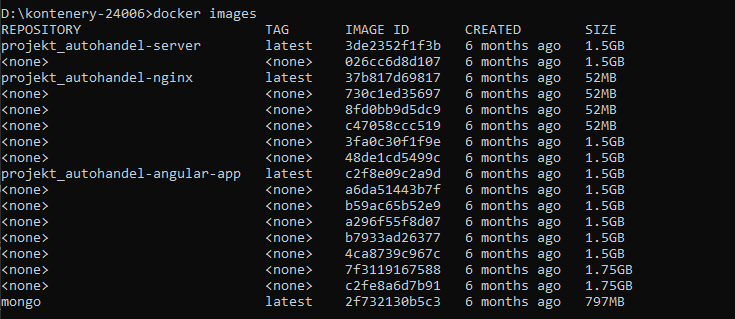

### Wyszukanie dostępnych obrazów ubuntu

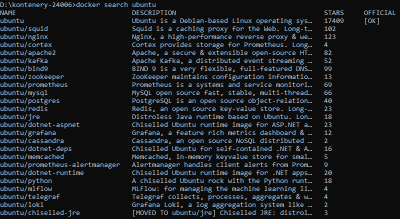

### Zainstalowanie obrazu ubuntu 22.04

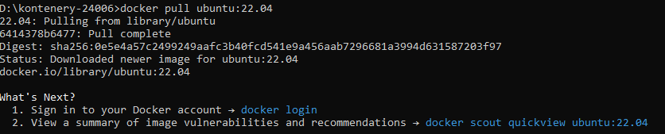

### Zainstalowanie innej wersji tego samego obrazu

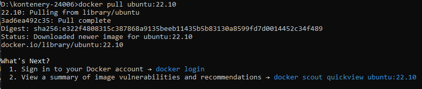

### Obrazy ubuntu są widoczne w systemie

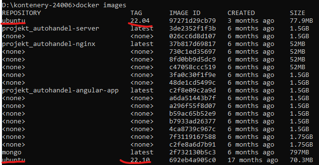

### Usunięcie obrazu ubuntu 22.10

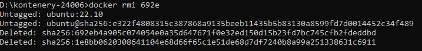

### Aktualnie ubuntu 22.10 nie jest zainstalowane na systemie

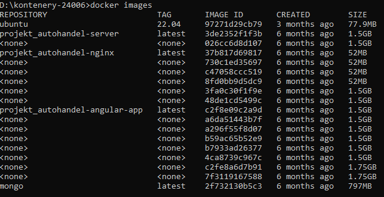

Skrótem do usuwania wszystkich obrazów jest ~docker rmi $(docker images -a -q)  

### Uruchomienie konteneru ubuntu, na którym odpalono komendę wyświetlającą napis 'Hello world!'

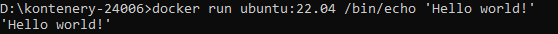

### Wyświetlenie wszystkich działających kontenerów

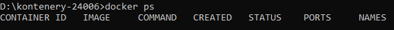

### Wyświetlenie wszystkich kontenerów, nawet tych zatrzymanych

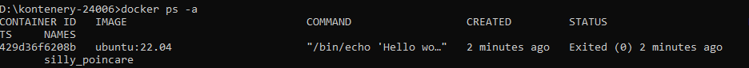

### Uruchomienie komendy bash w obrazie ubuntu, jak widać nie można nic wpisać w terminal obrazu

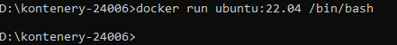

### Po wpisaniu docker ps -a okazuje się, że kontener natychmiastowo się zatrzymał

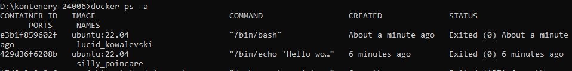

### Uruchomienie kontenera w trybie interaktywnym

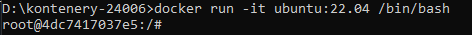

### Wykonanie komend w terminalu w obrazie ubuntu

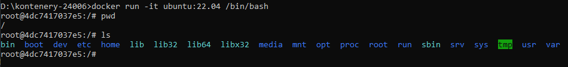

### Uruchomienie kontenera w trybie detached (w tle)

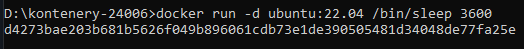

### Komenda docker ps pokazuje teraz działający kontener

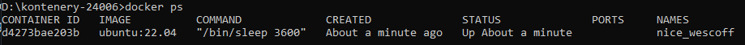

### Wywołanie komendy w działającym kontenerze

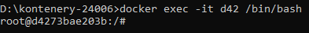

### Wypisanie wszystkich procesów w działającym kontenerze ubuntu

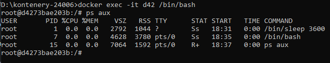

### Po wyjściu z terminala kontener dalej działa

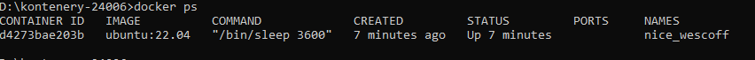

### Zatrzymanie kontenera

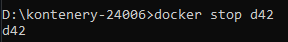

### Docker pokazuje, że kontener został zatrzymany z kodem 137

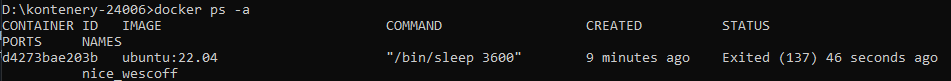

### Usuwanie kontenera

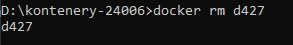

Skrót do usuwania wszystkich kontenerów docker rm $(docker ps -a -q)

