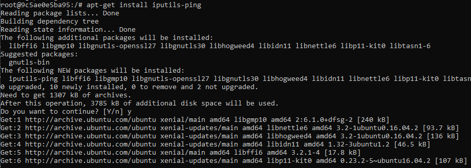

# Changing images

Ćwiczenie drugie zawiera komendy modyfikujące istniejące już obrazy.

### Pobranie obrazu ubuntu 16.04

### Utworzenie konteneru i uruchomienie terminalu, a następnie pingowanie adresu http

Ping nie działa, ponieważ obraz nie zainstalował automatycznie komendy. Należy ją zainstalować samemu.  

### Update software systemu ubuntu

### Instalacja pingu

### Teraz można pingować

# Instalowanie zmian z kontenera do wszystkich obrazów ubuntu

### Sprawdzenie IP kontenera z zainstalowanym pingiem

### Docker commit - komenda bierze kontener i tworzy z niego obraz z wprowadzonymi zmianami

### Zaktualizowany obraz jest widoczny w systemie

### Uruchomienie nowego kontenera na obrazie z zainstalowanym już pingiem. Od razu można użyć komendy.

