# Building images

W trzecim ćwiczeniu pokazane zostanie budowanie nowych obrazów za pomocą Dockerfile.  

### Usunięcie obrazu ubuntu z pingiem

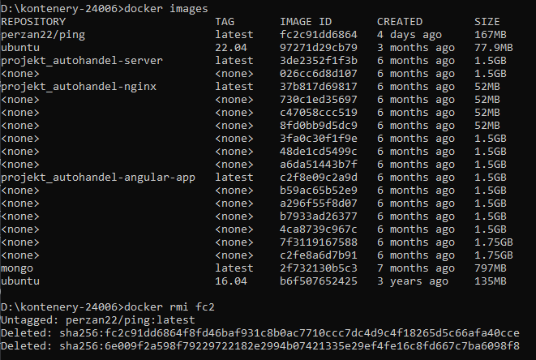

## Tworzenie dockerfile

### Zdefiniowanie obrazu

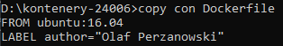

### Komendy instalujące ping w obrazie

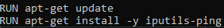

### Cały dockerfile

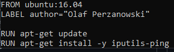

### Budowanie obrazu z Dockerfile

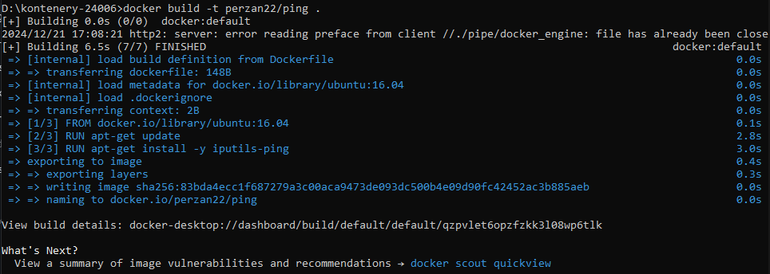

### Powtórzenie tej samej komendy pobierze obraz z pamięci podręcznej cache

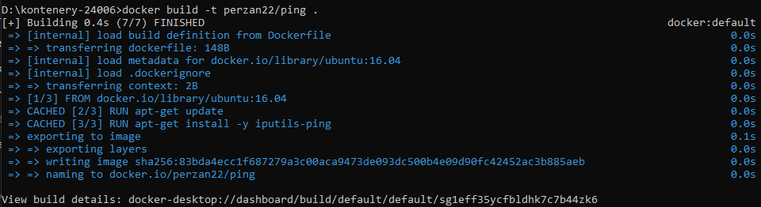

### Docker images pokazuje zbudowany obraz (167MB)

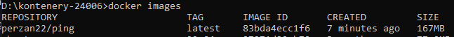

### Optymalizacja obrazu edytując Dockerfile komendą czyszczącą logi instalacji

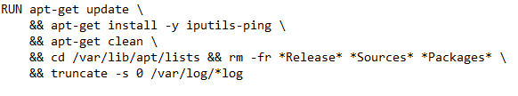

### Obraz jest teraz mniejszy 139MB

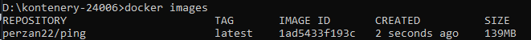

### Dodanie zmiennej środowiskowej ENV oraz komendę CMD, która wykonuje operacje po uruchomieniu obrazu

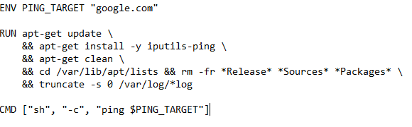

### Uruchomienie obrazu wywoła automatycznie ping

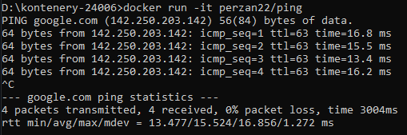