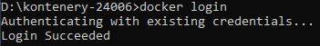
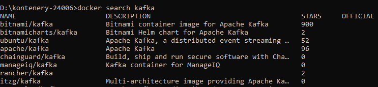
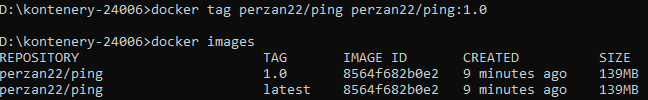
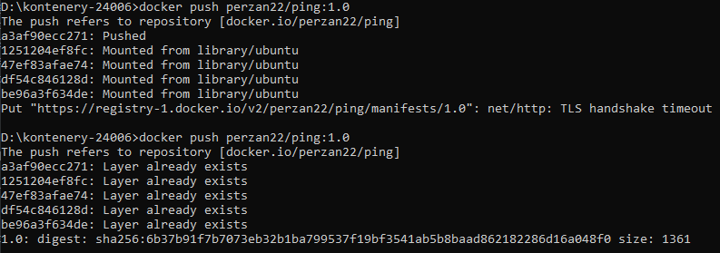

# Sharing images

Kolejne ćwiczenie dotyczy udostępniania obrazów na DockerHub.

### Zalogowanie się na konto DockerHub

### Szukanie obrazów

### Dodawanie tagu do obrazu

### Udostępnianie obrazu na swój profil dockerhub

