# Volumes

Ćwiczenie pokazuje działanie volume, czyli woluminy, które zachowują dane między różnymi kontenerami.  

### Odpalenie serwera z kontenera i sprawdzenie, czy działa

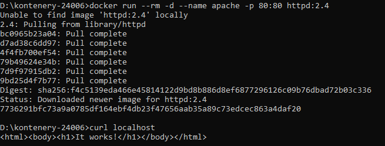

### Zamiana plików kontenera plikiem z hosta i sprawdzenie działania

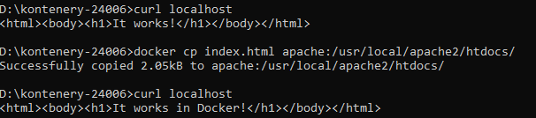

### Po zatrzymaniu kontenera odpalenie go na nowo nie ma naszej aktualizacji

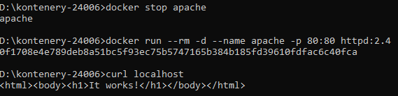

### Wyświetlenie wszystkich volume

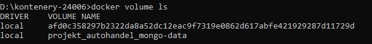

### Stworzenie nowego volume

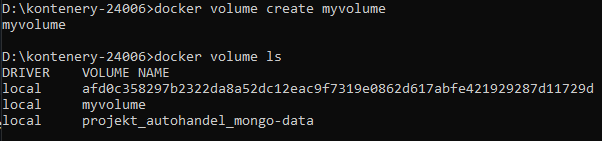

### Usuwanie volume

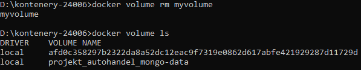

### Stworzenie volume httpd_htdocs

### Uruchomienie kontenera i przekazanie mu volume

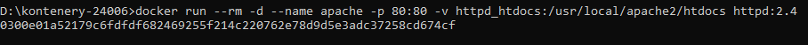

### Skopiowanie pliku html do kontenera z działającym volume

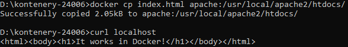

### Usunięcie i uruchomienie ponowne kontenera będzie zawierać naszą aktualizację dzięki użyciu volume

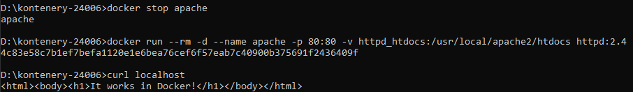

Volume pozwala przekazywać dane między jakiekolwiek kontenery httpd.  

### Zamiast używania volume, można też ustawić zmienną na ścieżkę hosta

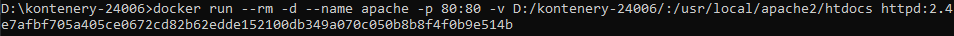

### Teraz zmiana pliku index.html wpływa na działanie kontenera

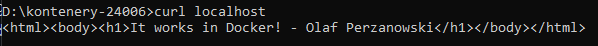