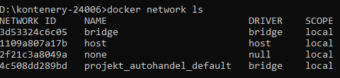
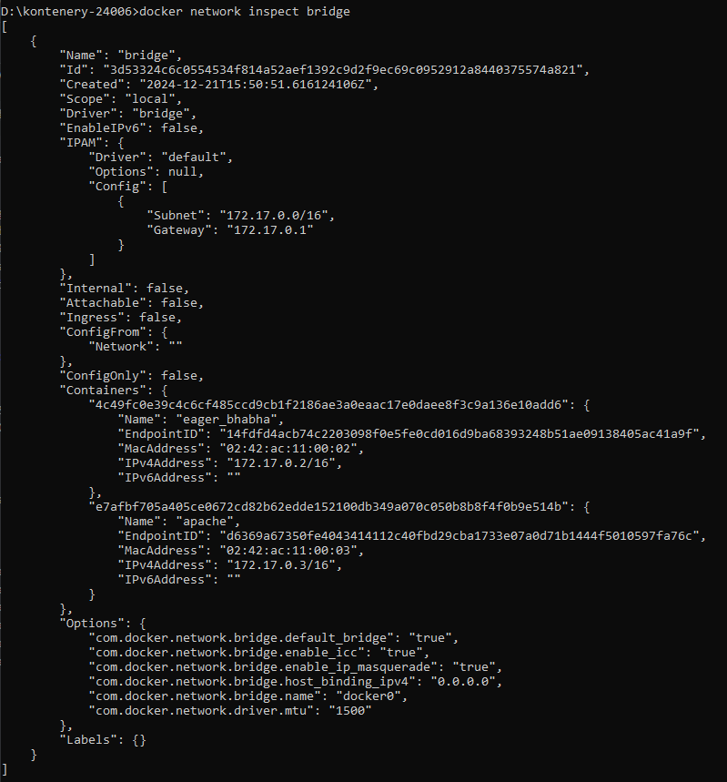
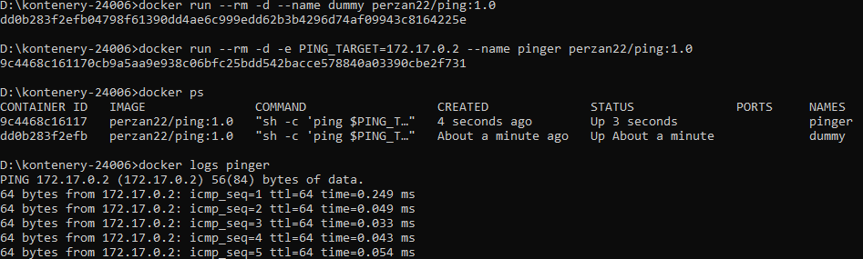
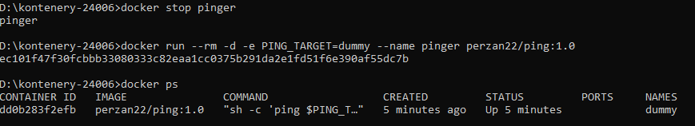
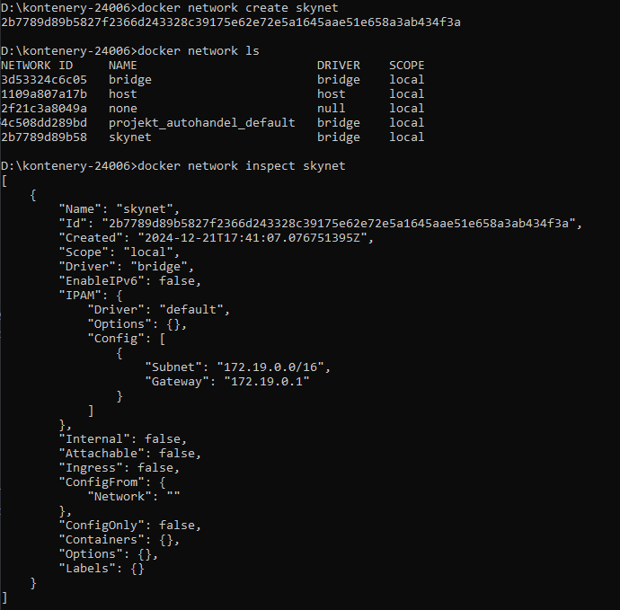
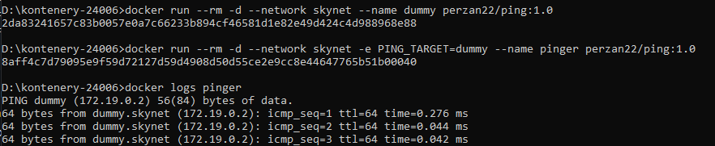
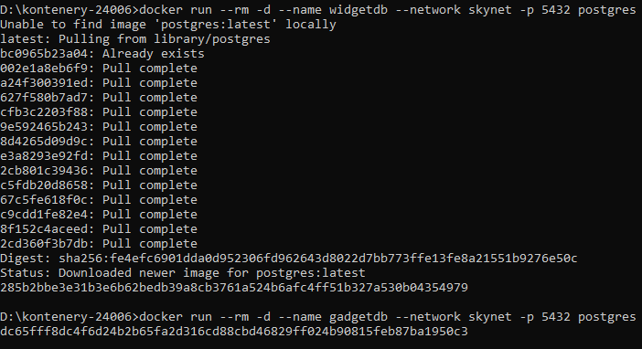

# Networking

Ostatnie ćwiczenie pokazuje działanie sieci i połączeń między kontenerami

### Wyświetlenie wszystkich dostępnych sieci

### Nowe kontenery domyślnie są w sieci bridge, sieć można sprawdzić

### Uruchomienie dwóch kontenerów pingujących

Jak widać kontener pinger poprawnie pinguje pierwszy z kontenerów. Adres może się jednak zmienić, dlatego lepiej pingować po nazwie kontenera.

### Zmiana PING_TARTGET na nazwę kontenera

Nie da się w sieci bridge pingować po nazwie, kontener od razu po uruchomieniu wyrzucił błąd i zatrzymał swoje działanie.

### Tworzenie własnej sieci

### Dodanie dwóch kontenerów do własnej sieci

Pinger może w stworzonej sieci pingować po nazwie kontenera

### Uruchomienie dwóch kontenerów baz danych postgress w sieci skynet

Niestety bazy danych po uruchomieniu od raazu się wyłączają. Załóżenuiem zadania było to, że w jednej sieci te bazy mogą się ze sobą połączyć po tym samym porcie lub łączą się z hostem.

