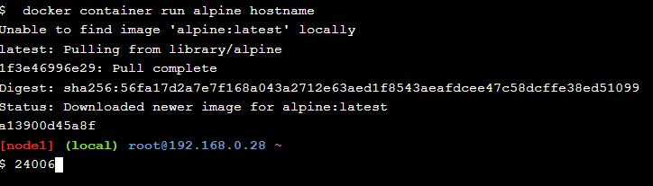
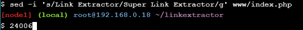

# Playing with docker labs

Play with docker labs jest narzędziem uczącym Dockera w praktyce. Narzędzie zawiera wbudowaną konsolę na której wykonuje się zadania.  
Narzędzie uczy dockera od podstaw do bardziej zaawansowanych funkcji. Podzielony jest na część dla developerów i DevOps. Poniżej zadania będą dla developerów.  
Na każdym zdjęciu widoczny jest indeks studenta.

---

## Docker for Beginners - Linux

Moduł pokazuje podstawy dockera.

### Sklonowanie środowiska GitHub

### Uruchomienie kontenera alpine - hostname wyświetla ID kontenera

### Wylistowanie wszystkich kontenerów

### Uruchomienie interaktywnego kontenera ubuntu

### Uruchomienie różnych komend w terkminalu ubuntu: ls - wylistowanie zawartości plików, ps - pokazuje działające procesy, cat - wyświetla wersję ubuntu, flaga rm usuwa kontener po zatrzymaniu

### Uruchomienie kontenera mysql w tle: --detach - uruchamia w tle, --name - nazywa kontener, -e ustawia zmienną środowiskową

\

### Wylistowanie działających kontenerów - bez paramteru all

### Wypisanie logów kontenera

### Wypisanie procesów działających w kontenerze

### Używanie komendy exec, do wykonania komend w działającym kontenerze - wypisanie wersji MySQL, uruchomienie nowego terminala, wypisanie wersji z terminala

---

## Tworzenie Dockerfile i uruchamianie aplikacji z Dockerfile

### Wyświetlenie zawartości Dockerfile

### Zapisanie lokalnie swojego DockerID

### Stworzenie nowego obrazu używając Dockerfile, tagując swoim DockerID

### Uruchomienie kontenera z własną aplikacją

### Działająca strona

### Usunięcie kontenera po zakończeniu działania

---

## Modyfikowanie własnej aplikacji w kontenerze

### Uruchomienie kontenera w docelowym folderze za pomocą --mount

### Edycja index.html

### Nowy widok strony

### Zmiana odbyła się w kontenerze, a nie zmieniono obrazu, więc po usunięciu i odpaleniu kontenera na nowo

### Strona wraca do oryginału

### Budowanie nowego obrazu i nadanie mu tagu 2.0

### Uruchomienie kontenera z obrazu 2.0

### Widok strony 2.0

### Uruchomienie starej wersji na innym porcie

### Widok strony na porcie 8080

### Wylistowanie obrazów dostępnych lokalnie

### Zalogowanie się i wysłanie obrazów 1.0 i 2.0 na DockerHUB

### Obrazy sa widoczne na DockerHUB

---

## Application Containerization and Microservice Orchestration

Moduł pokazuje działanie Docker Compose, a więc konteneryzacja różnych komponentów aplikacji jako mikroserwisy i następne zarządzanie nimi przez mechanizm orchestration.

## Skrypt linkextractor.py

### Zawartość skryptu

### Próby uruchomienia skryptu zakończone niepowodzeniem, przez na przykład brak biblioteki requests

W takich przypadkach konteneryzacja się najbardziej przydaje.

## Konteneryzacja skryptu

### Zawartość Dockerfile

### Budowanie obrazu za pomocą Dockerfile (jak widać będzie posiadać biblioteki requests i beautifulsoup4)

### Uruchomienie kontenera zapewnia poprawne działanie skryptu - wypisuje linki ze stron

## Ulepszenie skonteneryzowanego skryptu

### Zbudowanie obrazu ulepszonego skryptu

### Ulepszony output skryptu

## Konteneryzacja serwisu API

### Następna wersja skryptu używana jest w pliku python

### Zbudowanie, uruchomienie i wylistowanie skryptu

### Wysłanie zapytania HTTP pobiera linki ze strony

## Webowa wersja skryptu

### Zawartość docker-compose następnej wersji skryptu - jak widać łączy dwa obrazy: linkextractor i php 

### Uruchomienie serwisów z docker-compose, wylistowanie pokazuje dwa działające kontenery

### Link Extractor działa w wersji webowej

### Zamiana wszystkich powtórzeń Link Extractor na Super Link Extractor

### Wygląd zaktualizowanej strony

### Zatrzymanie i usuwanie serwisów z docker-compose

## Konteneryzacja z użyciem bazy danych Redis, która używa cache

### Dockerfile

### main.py

### docker-compose zawiera obraz python, php i redis

### Po zbudowaniu docker-compose, działa strona webowa, każde kolejne wyodrębnienie linków działa szybciej dzięki cache z redisa

### Odpalenie konsoli Redis wypisuje wyniki

## Zmiana API python na Ruby

### Aplikacja podobna jednak API zmienione z python na Ruby

### Aplikacja webowa działa

---

## Docker swarm

Moduł pokazuje działanie działanie Docker swarm.

## Aplikacja do głosowania

### Zainicjowanie środowiska Docker swarm, działanie w terminalu swarm manager

### Dodanie węzła worker do środowiska swarm

### Wypisanie listy węzłów w środowisku swarm

### Pobranie z github kodu aplikacji

### Wdrożenie aplikacji z pliku docker-compose do stosu swarma

### Wypisanie ile serwisów znajduje się na stosie swarma

### Wypisanie serwisów działających na stosie swarm

### Wypisanie zadań serwisu vote

