# DevOps with Docker part 1

Pierwsza część zadania DevOps with Docker wprowadz do takich tematów jak: uruchaminanie kontenerów, konteneryzacja aplikacji, przekazywanie danych i woluminów poza kontenerem, mapowanie portów i punlikowanie kontenerów publicznie. Poniżej wykonane zadania.

## Zadanie 1.1

### Uruchomienie 3 kontenerów w tle i zatrzymanie dwóch z nich

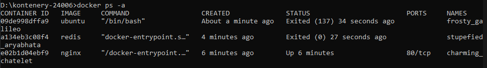

## Zadanie 1.2

### Usunięcie kontnerów i obrazów

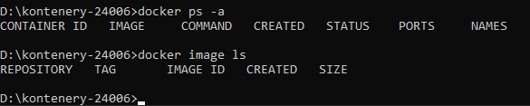

## Zadanie 1.3

### Wyświetlenie logów z działającego kontenera

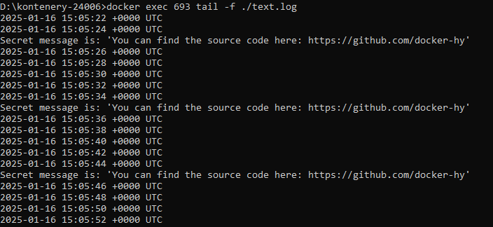

## Zadanie 1.4

### Działająca aplikacja wyświetlająca stronę helsinki.fi

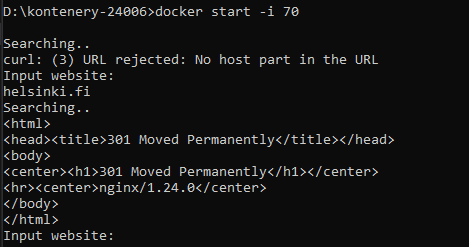

## Zadanie 1.5

### Porównanie rozmiaru obrazów

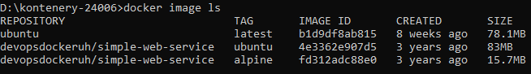

### Wykonanie komendy na obrazie

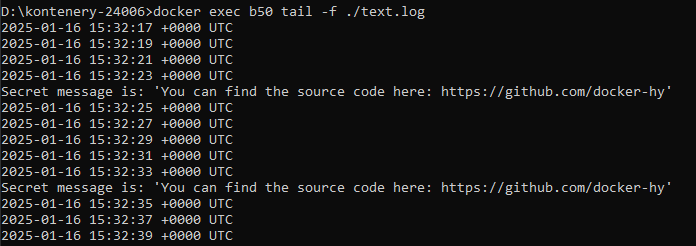

## Zadanie 1.6

### Znalezienie sekretnego hasła

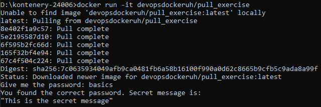

## Zadanie 1.7

### Dockerfile

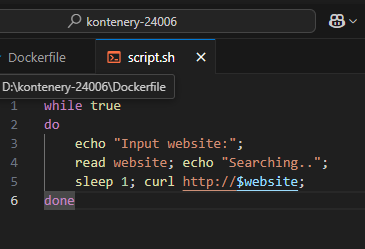

### Działający kontener

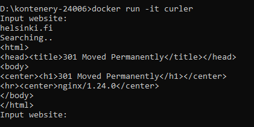

## Zadanie 1.8

### Dockerfile

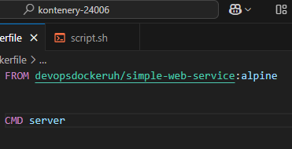

### Działanie kontenera

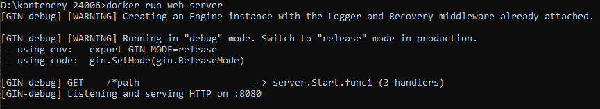

## Zadanie 1.9

### Zapisywanie za pomocą volumes

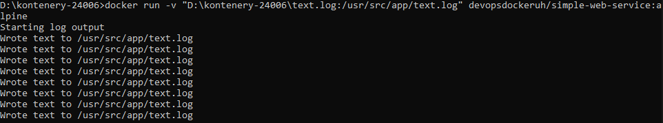

### Plik logs

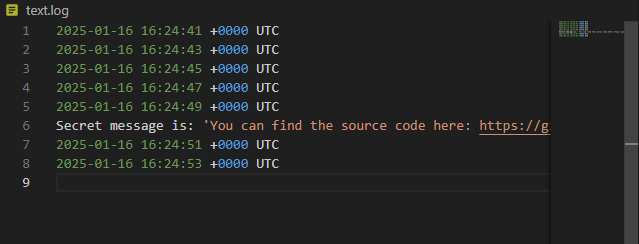

## Zadanie 1.10

### Odpalenie serwera

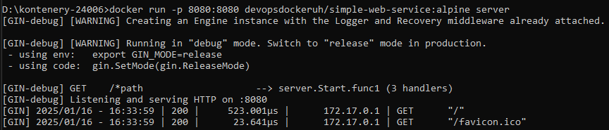

### Widok na przeglądarce

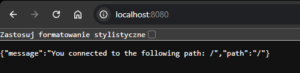

## Zadanie 1.11

### Dockerfile

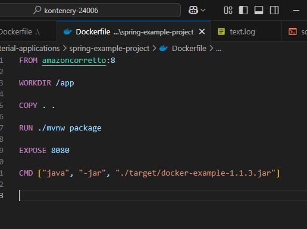

### Wynik na stronie

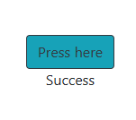

## Zadanie 1.12

### Dockerfile

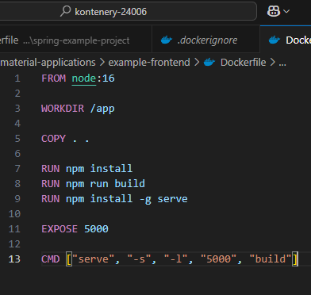

### Działająca strona

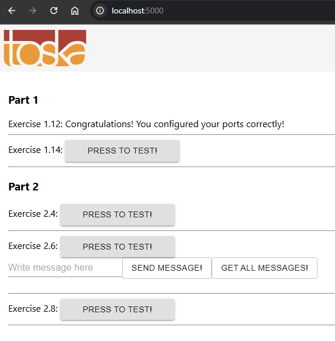

## Zadanie 1.13

### Dockerfile

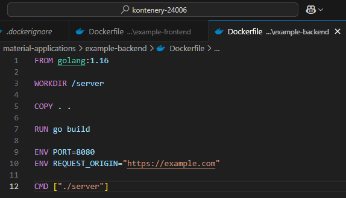

### Działający ping

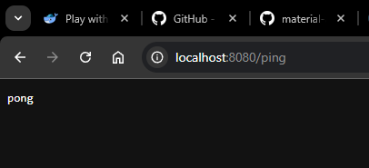

## Zadanie 1.14

### Dockerfile backend

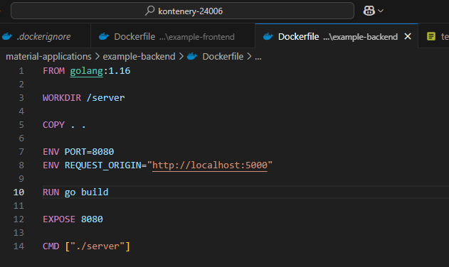

### Dockerfile frontend

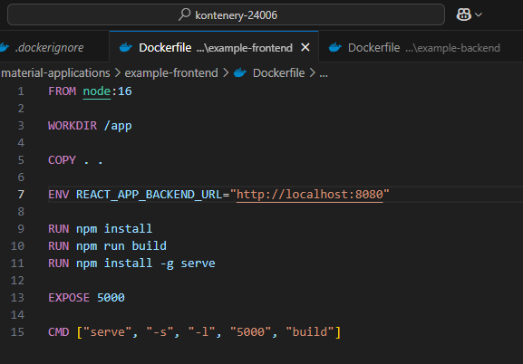

### Działający przycisk

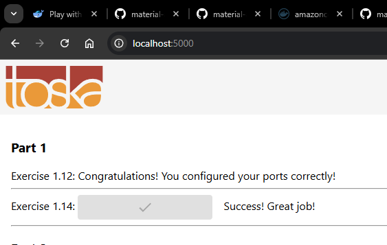

## Zadanie 1.15 i 1.16

Zadania są skoncentrowane na publikowaniu własnego projektu do chmury Docker Hub oraz na inne serwisy. W związku z brakiem takiego projektu na maszynie nie jestem w stanie wykonać zadania. Zadanie polegałoby na użyciu komendy 'docker login', wpisaniu hasła, a następnie komendą 'docker push usrName/repo' opublikować projekt w chmurze. 

