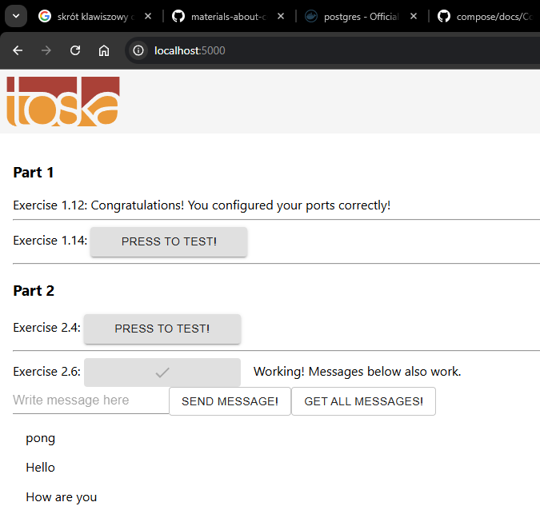
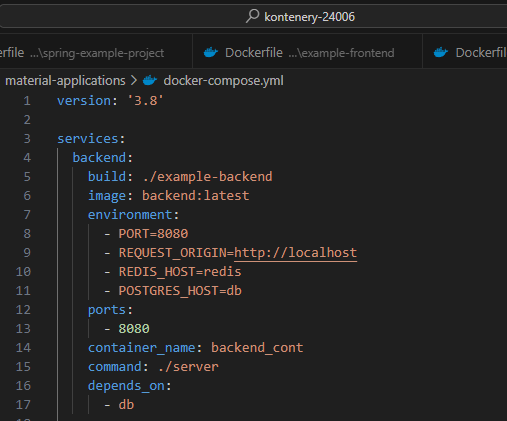

# DevOps with Docker part 2

Ćwiczenie wprowadza do zarządzania kontenerami za pomocą Docker Compose oraz wprowadza do sieci Dockera. 

## Zadanie 2.1

### Dockerfile

### docker-compose.yml

### Zapisane logi w pliku text.log

## Zadanie 2.2

### docker-compose.yml

### Wynik działania na stronie

## Zadanie 2.3

### Dockerfile backend

### Dockerfile frontend

### docker-compose.yml

### Działająca strona

## Zadanie 2.4

### docker-compose.yml z redisem pobranym z docker hub

### Działająca strona

## Zadanie 2.5

### docker-compose.yml zadania skalowania serwisów

### Użyta komenda do uruchomienia aplikacji

### Działające szybsze obliczanie wybiku

## Zadanie 2.6

### docker-compose.yml z dodaną bazą postgres

### Działające zapisywanie do bazy danych

## Zadanie 2.7

### Dodanie volume do docker-compose.yml

### Zapisanie odpowiedzi do bazy danych i zewnętrznego folderu database

### Zatrzymanie kontenerów

### Uruchomienie konteneró ponownie

### Wiadomości zostały odczytane po ponownym uruchomieniu

### Po usunięciu folderu database brak wiadomości w bazie danych

## Zadanie 2.8

### Dodanie serwera proxy

### Łączenie się za pomocą localhost do frontendu i localhost/api do backendu

## Zadanie 2.9

### Zmiana w docker-compose.yml w serwisie backend

### Zmiana w Dockerfile w serwisie frontend

Zmieniono też port w docker-compose.yml na - 5000 zamiast - 5000:5000.

### Plik nginx.conf

### Działająca strona

## Zadanie 2.10

### Wszystkie porty przestały być otwarte na zewnątrz - sprawdzenie

Ostatnie 4 porty są systemowymi portami, uruchomionymi przez usługę RPC, na Windows nie powinno się ich zamykać. Nie są one jednak wystawione na zewnątrz.

  