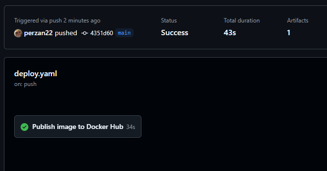
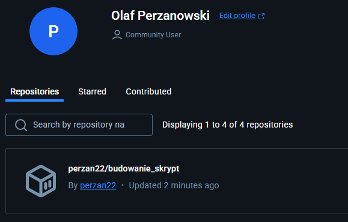

# DevOps with Docker part 3

Ćwiczenia z powyższego folderu wprowadzają do optymalizacji kontenerów oraz o wdrażaniu. Zostaną również poruszone inne rozwiązania zarządzania kontenerów.

## Zadanie 3.1

### Plik deploy

### Działanie GitHub Actions

### Odpalenie kontenera z utworzonego obrazu w tle

### Działająca strona na porcie 8080

### Watchtower

### Uruchomienie watchtower i kontenera w tle

### Strona przed zmianami

### Wprowadzenie zmian w kodzie i push na github

### Zmiana po włączeniu watchtower wywołała GitHub Actions, więc image powinien się automatycznie zaktualizować

### Image w Docker Hub się zaktualizował

### Zmiana na stronie po odświeżniu strony, bez uruchmiania kontenera na nowo

## Zadanie 3.3

### Skrypt builder.sh

### Uruchomienie skryptu

### Nowy obraz w Docker Hub

## Zadanie 3.4

### Dockerfile

### Dodanie logowania do skryptu

### Zbudowanie obrazu z Dockerfile

### Uruchomienie kontenera Docker

Brak zdjęcia przez dane logowania

### Utworzony obraz test

## Zadanie 3.5

### Dockerfile frontend z dodanym userem

### Dockerfile backend z dodanym userem

### Sprawdzenie usera frontend

### Sprawdzenie usera backend

### Sprawdzenie działania strony

## Zadanie 3.6

### Sprawdzenie wielkości obrazów przed zmianami

### Połączenie komend RUN w Dockerfiles i usunięcie niepotrzebnych zależności po produkcji

### Modyfikacje w Dockerfiles zmniejszyły frontend i backend o kolejno 170MB i 90MB

## Zadanie 3.7

### Zmiana image w Dockerfiles na node:16-alpine i golang:1.16-alpine spwoodowała zmniejszenie obrazów o 500-600MB

### Aplikacja nadal działa

## Zadanie 3.8

### Multi-stage Dockerfile frontend

### Rozmiar frontend image mniejszy o kolejne 170MB

## Zadanie 3.9

### Multi-stage Dockerfile backend

### Rozmiar backend image zmniejszony do 25MB

## Zadanie 3.10

### Początkowy rozmiar obrazu perzan22/express_app

### Dockerfile przed zmianami

### Zaktualizowany Dockerfile

### Rozmiar obrazu po aktualizacji mniejszy o 800MB

### Kontener używa safeUser

### Aplikacja działa

## Zadanie 3.11

### Diagram kubernetess

