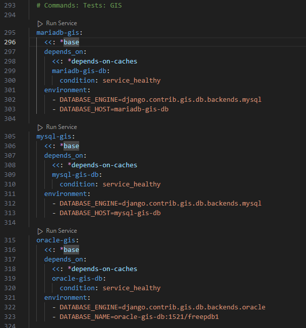

# Analiza projektu wykorzystującego Dockera

## Django Docker Box

Projekt który będzie analizowany jest dostępny na GitHub:  

[Repozytorium](https://github.com/django/django-docker-box)  

Projekt udostępnia konfigurowalne środowisko do łątwego uruchamiania i rozwijania aplikacji Django. Projekt umiożliwia szybkie przygotowanie kontenerów do aplikacji Django.

## Analiza Dockerfile

### Początek

ARG ustawiają zmienne definiujące wersję pythona, zmienne te można używać później w Dockerfile. 

Następnie określany jest obraz bazowy, z którego zbudowany zostanie kontener. W tym przypadku użyto python:3.10 w wersji slim - a więc minimalny obraz Debian.  
Następne linie LABEL dodają metadane do obrazu Docker, takie jak autorów, dokumentacje czy potrzebne linki.  
Komenda SHELL ustawia powłokę używaną do poleceń w Dockerfile. W powyższym przypadku jest to konsola bash. UStawiane w konsoli są warunki kiedy powłoka kończy działanie, a także wypisywane będą wszystkie polecenia podczas ich wykonywania.  

Komendy ENV ustawiają zmienne środowiskowe dostępne w kontenerze. 

### Tworzenie Usera

Następnie w obrazie dodawany jest user dla kwestii bezpieczeństwa, ponieważ taki użytkownik nie będzie miał dostępu do plików systemowych. W komendzie ustawiany jest katalog domowy użytkownika, flaga --no-log-init zapobiega tworzeniu logów dla użytkownika. User dostaję nazwę django.  
Następnie tworzone są katalogi w kontenerze, któremu później komendą chown nadajemy użytkownikowi prawa właściciela utworzonych katalogów dla django.  

### Instalowanie zależności

W następnym kroku instalowane są zależności systemowe oraz zależności pythona.  

Komenda copy kopiuje plik packages.txt z lokalnego systemu do kontenera. Plik ten zawiera listę zależności systemowych. Naastępnie komenda RUN urachamia polecenie, którego zadaniem jest instalacja tych zależności. Flaga --mount "montuje" cache z lokalnego systemu do kontenera, dzięki czemu przyszłe instalacje pakietów będą odbywały się szybciej.  
Komenda rm usuwa plik konfiguracyjny, któryv mógłby automatycznie czyścić pamięć cache po zakończeniu instalacji.  
Następnie apt-get update aktualizuje wszystkie pakiety systemowe.  
Komenda xargs instaluje potrzebne zależności z pliku packages.txt.  

Zależności pythona instalowane są w podobny sposób. Nahjpierw kopiowane są lokalne pliki requirements.txt do folderów w kontenerze. Pliki te zawierają listę potrzebnych zależności.  
Kopiowane jest również narzędzie uv z obrazu ghcr.io/astral-sh/uv, które będzie później wykorzystane przy instalacji zależności.  
Komenda RUN uruchamia instalację zależności. Znowu montowana jest pamięć cache, a następnie narzędziem uv instalowane są zależności z pliku requirements/  

### Końcowa konfiguracja 

W ostatnim kroku Dockerfile konfigurowane są opcje uruchomieniowe obrazu.  
Najpierw kopiowany jest lokalny plik entrypoint.bash, któy zawiera skrypt uruchamiający aplikację.  
Nastęnie zmieniana jest powłoka na zwykłego basha umożliwiającego uruchamianie poleceń w formie skryptów.  
Definiowane są kolejne zmienne środowiskowe, ustawiające plik konfiguracyjny na settings.py oraz ścieżkę do miejsca, w którym python ma szukać modułów i pakietów.  
Następnie ustawiany jest komenda USER użytkownik, który będzie wykonywał polecenia.  
Komenda VOLUME definiuje wolumeny, które pozwalają trwale przechowywać dane wyjściowe i wejściowe poprzez współdzielenie danych między kontenerem a hostem.  
WORKDIR ustawia katalog roboczy.  
Komenda ENTRYPOINT ustawia punkt wejścia kontenera, czyli polecenie, które zostanie uruchomione wraz z uruchomieniem kontenera. W tym przypadku będzie to uruchomienie skryptu entrypoint.bash, który wcześniej został skopiowany do folderu django.  

## Analiza docker-compose.yml (compose.yml)

### Szablony konfiguracyjne  

Na początek definiowane są szablony konfiguracyjne. Są to częsći kodu, które zawierają zmienne lub parametry, które mogą być dynamicznie wypełniane w czasie uruchomienia aplikacji, budowania środowiska, czy konfiguracji systemu. Szablony sałużą do generowania plików, które są wykorzystywane przez różne aplikacje, serwery, czy środowiska programistyczne.  

### Szablon konfiguracji base 

x-base: &base jest deklaracją szablonu konfiguracyjnego. Użycie $base umożliwia tworzenie szablonu yaml. Taki szablon może być wielokrotnie używany za pomocą *base. Kolejne szablony będą definiowane w podobny sposób.  
Nastęnie określany jest obraz, z którego zostanie zbudowany kontener jeśli jest dostęny lokalnie lub w rejestrorze zewnętrznym.  
Komenda build buduje obraz na podstawie wskazanego Dockerfile (w tym przypadku Containerfile), jeśli nie istnieje obraz na zewnątrz. Context i dockerfile określa gdzie znajduje się plik. Args zawiera argumenty przekazywane do procesu budowania obrazu. Additional_contexts wskazuje na dodatkowy kontekst. W tym przypadku jest to lokalizacja, w której znajduje się kod źródłowy django.  
Volumes określa woluminy, czyli to jak katalogi w hoście będą montowane na katalogi w kontenerze.  

### Szablon konfiguracji mysql-base 

Powyższy szablon dotyczy usługi MySQL.  
Określane są zmienne środowiskowe, a także woluminy podobnie jak we wcześniejszym szablonie.  
Sekcja tmpfs montuje tymczasowe pliki w pamięci RAM. Przyspiesza to operacje zapisów w bazie danych.  
Sekcja deploy określa sposób wdrażania usługi. Mode: global oznacza, że usługa będzie uruchamiała dokładnie jedno zadanie aż do momentu zatrzymania w każdym węźle w klastrze.  
Restart określa jak kontener ma się zachowywać w przypadku awarii kontenera. Parametr unless-stopped ustawia, że kontener automatycznie się uruchomi, dopóki nie zostanie ręcznie zatrzymany.  
Sekcja healthcheck określa w jaki sposób Docker sprawdza stan kontenera. Dzięki temu kontenery są odpowiednio monitorowane. Atrybut interval określa co jaki czas wykonywane jest sprawdzenie. Timeout określa limit czasowy sprawdzenia. Retries określa ile razy sprawdzenie się wykonuje. Po przekroczeniu tej liczby kontener zostaje uznany za uszkodzony. Start_period określa że pierwsze sprawdzenie zostanie uruchomione dopiero po jakimś czasie, a start_interval określa jak często Docker będzie sprawdzał stan kontenera po jego uruchomieniu.  

### Szablon konfiguracyjny oracle

Ten fragment ustawia kontener oracle w Dockerze. 

Konfiguracja jest bardzo podobna do poprzedniego kontenera. Wspomnieć można o atrybucie test w sekcji healthcheck. Atrybut określa jaki skrypt ma zostać użyty, aby sprawdzić stan zdrowia.  

### Szablon konfiguracyjny postgres

Konfiguracja szablonu jest bardzo podobna do szablonu oracle, oczywiście z innymi zmiennymi. W tym szablonie ustawiane jest również w sekcji command zachowanie kontenra po jego uruchomieniu. W tym przypadku po uruchomieniu ustawiane są różne parametry konfiguracyjne dla serwera postgres.  

### Szablony memcached i redis 

Konfiguracje tych szablonów są bardzo podobne do poprzedniej. Na początek ustawiane są jednak obrazy z których kontenery będą budowane.  

### Szablon cache-depends

Szablon ten określa stan kontenerów jakie muszą być, aby reszta serwisów działała. W powyższym memcached-1, memcached-2 i redis muszą być 'zdrowe' aby inne usługi się uruchomiły.  

### Szablon selenium

Selenium jest narzędziem do automatyzacji testowania aplikacji webowych.  

W szablonie wspomnieć można o atrybucie shm_size, który określa rozmiar pamięci współdzielonej dla kontenera. Jest to istotne dla wydajności.  
Atrybut depends_on określa zależność kontenera od innych usług. Kontener selenium nie uruchomi się dopóki selenium-hub nie będzie działać poprawnie.  

### Wolumeny 

Ta sekcja definiuje wolumeny, które są potem wykorzystywane przez kontenery.  
User-cache jest wolumenem, który może być wykorzystywany do przechowywania danych z pamięci cache między różnymi kontenerami.  

## Serwisy  

Serwisy są kontenerami lub grupami kontenerów, razem z konfiguracją tych kontenerów.  

### Serwis mariadb-db

Serwis uruchomi kontener bazy danych MariaDB.  

  

<<:  - jest to odwołanie do szablonu mysql-base. Serwis dziedziczy wszystkie parametry z tego szablonu.  
Sekcja image określa jakiego obrazu użyje serwisdo zbudowania kontenera. &mariadb-image jest aliasem. Do aliasu można się odwoływać, jeśli zajdzie tak potrzeba. W tym przypadku będzie to odwołanie do obrazu mariadb:${MARIADB_VERSION}  
Sekcja command określa jakie komendy zostaną wykonane po uruchomieniu kontenera.  
Healthcheck podobnie jak wczesniej w szablonach określa jak sprawdzany jest stan kontenra. Tutaj też dziedziczy po *mysql-base-healthcheck  

### Serwisy mysql-gis, oracle, oracle-gis, postgres-db, postgres-gis-db, memcached-1, memcached-2, redis i selenium 

  
  

Kolejne serwisy dziedziczą po szablonach konfiguracyjnych.  

### Serwis selenium-hub 

Serwis selenium hub jest centralnym punktem do którego podłączają się inne węzły Selenium.  

  

Serwis korzysta z obrazu selenium/hub.  
Następnie określane jest mapowanie portów. Zapis 4442-4444:4442:4444 oznacza, że porty 4442, 4443, 4444 w kontenerze są dostępne na tych samych portach w hoście.  
Reszta sekcji jest podobna do wcześniej opisywanych.  

### Serwisy związane z testowaniem aplikacji django

Następnie definiowane są serwisy, które związane są z testowaniem aplikacji Django. Wszystkie serwisy są do siebie podobne (dziedziczą po szablonach), a ich celem jest przygotowanie środowisk do testów różnych baz danych. W serwisach zmieniają się tylko zmienne określające typ silnika bazy danych.   

  
   

### Serwisy do testowania GIS  

Kolejnymi serwisami są takie obsługujące przestrzenne dane (GIS). Django oferuje wsparcie dla takich zmiennych za pomocą django.contrib.gis. Serwisy są bardzo podobne do tych poprzednich, jednak typ silnika jest przystosowany do przetwarzania przestrzennych danych.  

  
  

### Serwisy testujące Selenium

Kolejne serwisy są konfigurowane w celu testowaniu aplikacji Django z użyciem Selenium - narzędzia, które automatyzuje testy aplikacji webowych. Każdy z serwisów określa kontenery dla testów danej przeglądarki: Chrome, Edge i Firefox. W serwisach zmieniane są ENTRYPOINT określające jaką przeglądarkę chcemy otworzyć. Używany jest ten sam selenium-hub, któy umożliwia komunikację między różnymi węzłami. Depends_on określa że przed uruchomieniem serwisu musi być uruchomiony selenium_hub i serwis przeglądarki.  

  

### Pozostałę serwisy  

  

Ostatnimi serwisami są pre-commit i sphinx. Serwis pre-commit uruchamia skrypt pre-commit, który wykonuje różne zadania przed commitowaniem zmian w repozytorium. Serwis sphinx uruchamia polecenie make w kontekście dokumentacji. W tym przypadku serwis generuje automatycznie dokumenrtację.  

W serwisie pre-commit warto wspomnieć o atrybucie SKIP w sekcji environment. To ustawienie zmienia domyślne zachowanie pre-commit, pomijając uruchomienie danego skryptu (w tym przypadku eslint).  
W serwisie sphinx w sekcji environment, atrybut BUILDDIR określa katalog, do którego zapisane zostaną wygenerowane dokumenty.  

